# 不同GC的分析

## 第一题

### 采用串行GC的执行情况：  
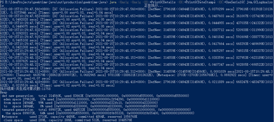
 
### 采用并行GC的执行情况：  
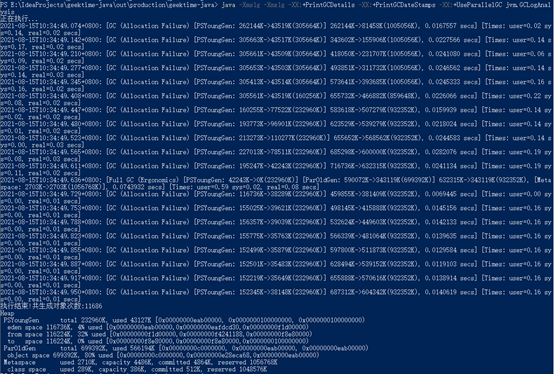
 
### 采用CMS GC的执行情况：  
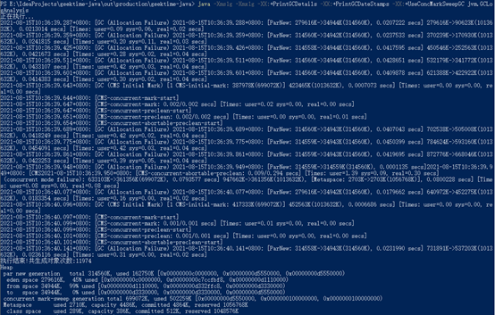
 
### 采用G1 GC的执行情况：  


----------------------------------
 

## 第二题
### 采用CMS GC启动服务，进行压测
#### 启动参数为：
```java -jar -Xms1g -Xmx1g -XX:+UseConcMarkSweepGC -XX:+PrintGCDetails -XX:+PrintGCDateStamps .\gateway-server-0.0.1-SNAPSHOT.jar```</br>
#### 压测命令为：
```sb -u http://localhost:8088/api/hello -c 40 -N 60  ```</br>
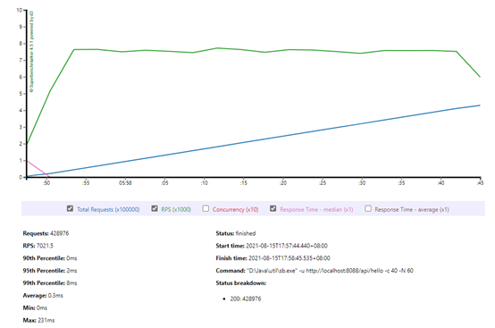
 
#### GC日志在easygc上的分析：  
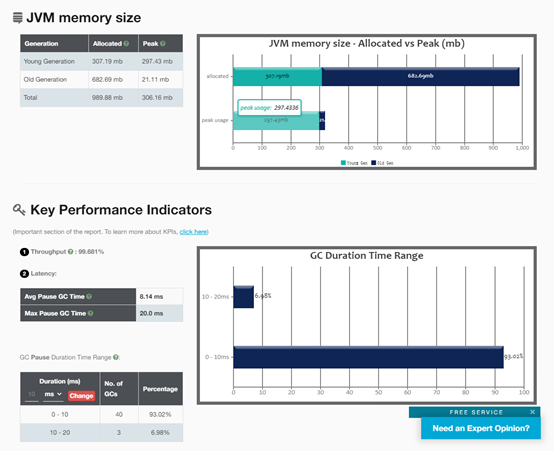  


------------------------------------
 
 

### 采用G1 GC启动服务，进行压测
#### 启动参数为：
```java -jar -Xms1g -Xmx1g -XX:+UseG1GC -XX:MaxGCPauseMillis=50 -XX:+PrintGCDetails -XX:+PrintGCDateStamps .\gateway-server-0.0.1-SNAPSHOT.jar``` </br>
#### 压测命令为：
```sb -u http://localhost:8088/api/hello -c 40 -N 60  ``` </br>
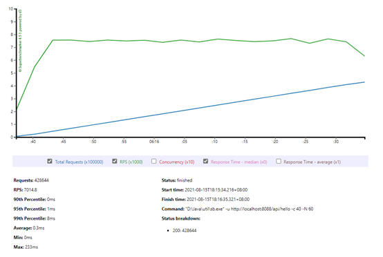    
#### GC 日志在easygo上的分析：  
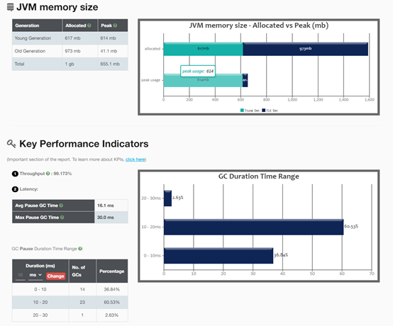  
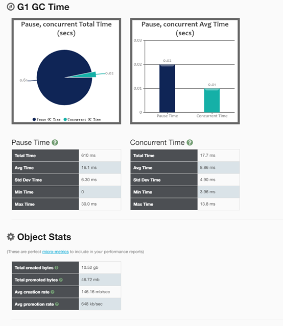

--------------------------------------------
 
 
### 采用Parallel GC启动服务，进行压测
#### 启动参数为：
```java -jar -Xms1g -Xmx1g -XX:+UseParallelGC -XX:+PrintGCDetails -XX:+PrintGCDateStamps .\gateway-server-0.0.1-SNAPSHOT.jar```</br>
#### 压测命令为：
```sb -u http://localhost:8088/api/hello -c 40 -N 60```</br>
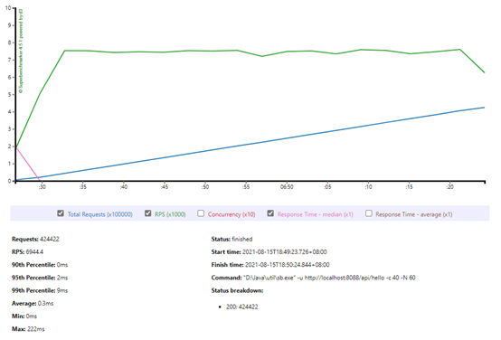
 
#### GC 日志在easygo上的分析：  
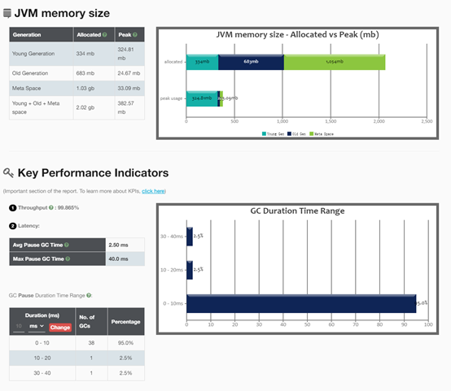  


--------------------------------------------

 
### 采用Serial GC启动服务，进行压测  
#### 启动参数为：
```java -jar -Xms1g -Xmx1g -XX:+UseSerialGC -XX:+PrintGCDetails -XX:+PrintGCDateStamps .\gateway-server-0.0.1-SNAPSHOT.jar```</br>
#### 压测命令为：
```sb -u http://localhost:8088/api/hello -c 40 -N 60  ```</br>
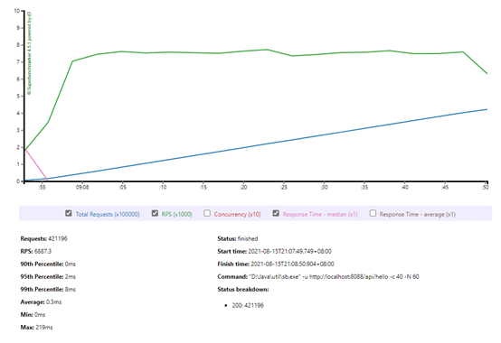
 
#### GC 日志在easygo上的分析：  
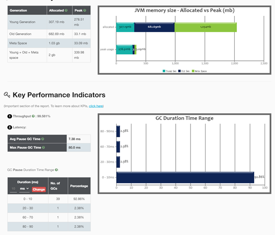  
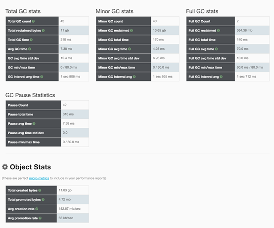

-------------------------------
 
 
## 第四题
### 对比Serial GC和Parallel GC：
通过对比分析第二题中压测的Serial GC和Parallel GC的GC使用情况，发现Pause total time（暂停总耗时）在Parallel GC中是100ms，而Serial GC中是310ms；查看GC耗时，发现Serial GC中存在一次full GC耗时达到80ms，而Parallel GC耗时最长的也才40ms；故可以得出结论：**Parallel GC无论是在总体暂停耗时和最大耗时表现都要比Serial GC要好**。<br>
对比Serial GC和Parallel GC两者在压测下的表现，Serial GC是6887.3Request/sec，而Parallel GC是6944.4Request/sec，**Parallel GC的服务性能表现也要更好**。

### 对比Parallel GC和CMS GC：
通过对比分析第二题中压测的CMS GC和Parallel GC的GC使用情况，发现Pause total time（暂停总耗时）在Parallel GC中是100ms，而CMS GC中是350ms；查看GC耗时，发现Parallel GC中最大GC耗时为40ms，而CMS GC暂停耗时最长的也才20ms；故可以得出结论：**Parallel GC在总体暂停耗时的性能要更好，但CMS GC耗时更均衡，最大耗时比Parallel GC要好**。</br>
对比Serial GC和Parallel GC两者在压测下的表现，CMS GC是7021.5Request/sec，而Parallel GC是6944.4Request/sec，**CMS GC的服务性能表现要更好一些**，这可能与CMS GC在发生GC的操作过程中，应用线程可以与GC线程一起运行的缘故。
### 对比CMS GC和G1 GC：
通过对比分析第二题中压测的CMS GC和G1 GC的GC使用情况，发现Pause total time（暂停总耗时）在G1 GC中是610ms，而CMS GC中是350ms；查看GC耗时，发现G1 GC中最大GC耗时为30ms，而CMS GC暂停耗时最长的也才20ms；**G1 GC的表现都不如CMS GC**。<br>
这与我们的预期不符，不过在将G1 GC的启动参数中的-XX:+PrintGCDetails改为-XX:+PrintGC后，G1 GC的表现好了很多，暂停总耗时变为116ms，而且最长暂停耗时不过7ms，整体表现都优于CMS GC，这说明**开启GC日志是会损耗系统性能的，特别是打印明细日志**。  
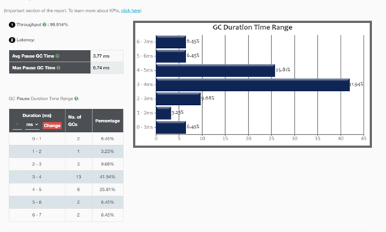  

 
对比Serial GC和Parallel GC两者在压测下的表现，CMS GC是7021.5Request/sec，而G1 GC是7014.8Request/sec，CMS GC的服务性能表现要更好一些。
### 总结：
在生产环境中，如果系统对GC暂停耗时不敏感，可以考虑设置为Parallel GC，只要服务占用内存超过1G，就**不要使用Serial GC**；如果系统对GC暂停耗时敏感，建议使用CMS GC或者G1 GC，设置G1 GC的时候，**不要忘记合理设置-XX:MaxGCPauseMillis参数**，有必要的话添加-XX:ConcGCThreads设置GC线程数。

