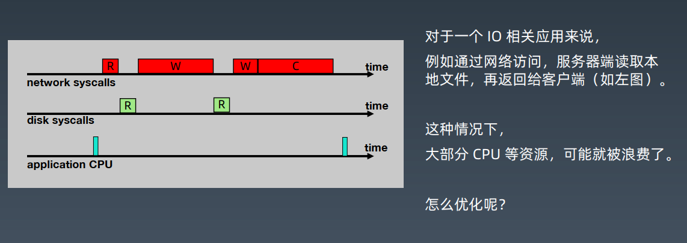

# NIO学习笔记

## Java Socket编程

### 服务器通信原理


### 最简单的HTTP服务器 01

```java
package java0.nio01;

import java.io.IOException;
import java.io.PrintWriter;
import java.io.Writer;
import java.net.ServerSocket;
import java.net.Socket;

public class HttpServer01 {
    public static void main(String[] args) throws IOException {
        // 创建ServerSocket，并绑定端口
        ServerSocket serverSocket = new ServerSocket(8801);
        while (true) {
            try {
                // 通过accept方法拿到Socket并处理
                Socket socket = serverSocket.accept();
                service(socket);
            } catch (IOException e) {
                e.printStackTrace();
            }
        }
    }

    private static void service(Socket socket) {
        try {
            PrintWriter printWriter = new PrintWriter(socket.getOutputStream(), true);
            printWriter.println("HTTP/1.1 200 OK");
            printWriter.println("Content-Type:text/html;charset=utf-8");
            String body = "hello,nio1";
            printWriter.println("Content-Length:"+body.getBytes().length);
            printWriter.println();
            printWriter.write(body);
            printWriter.close();
            socket.close();
        } catch (IOException e) {
            e.printStackTrace();
        }
    }
}

```

### 每个客户端请求进来创建一个线程

```java
package java0.nio01;

import java.io.IOException;
import java.io.PrintWriter;
import java.net.ServerSocket;
import java.net.Socket;

public class HttpServer02 {
    public static void main(String[] args) throws IOException {
        ServerSocket serverSocket = new ServerSocket(8802);
        while (true) {
            try {
                Socket socket = serverSocket.accept();
                new Thread(() -> {
                    service(socket);
                }).start();
            } catch (IOException e) {
                e.printStackTrace();
            }
        }
    }

    private static void service(Socket socket) {
        try {
            PrintWriter printWriter = new PrintWriter(socket.getOutputStream(), true);
            printWriter.println("HTTP/1.1 200 OK");
            printWriter.println("Content-Type:text/html;charset=utf-8");
            String body = "hello,nio2";
            printWriter.println("Content-Length:" + body.getBytes().length);
            printWriter.println();
            printWriter.write(body);
            printWriter.close();
            socket.close();
        } catch (IOException e) {
            e.printStackTrace();
        }
    }
}

```

### 创建一个固定的线程池来处理

```java
package java0.nio01;

import java.io.IOException;
import java.io.PrintWriter;
import java.net.ServerSocket;
import java.net.Socket;
import java.util.concurrent.ExecutorService;
import java.util.concurrent.Executors;

public class HttpServer03 {
    public static void main(String[] args) throws IOException {
        ExecutorService executorService = Executors.newFixedThreadPool(Runtime.getRuntime().availableProcessors() + 2);

        final ServerSocket serverSocket = new ServerSocket(8803);
        while (true) {
            try {
                final Socket socket = serverSocket.accept();
                executorService.execute(() -> service(socket));
            } catch (IOException e) {
                e.printStackTrace();
            }
        }
    }

    private static void service(Socket socket) {
        try {
            PrintWriter printWriter = new PrintWriter(socket.getOutputStream(), true);
            printWriter.println("HTTP/1.1 200 OK");
            printWriter.println("Content-Type:text/html;charset=utf-8");
            String body = "hello,nio3";
            printWriter.println("Content-Length:" + body.getBytes().length);
            printWriter.println();
            printWriter.write(body);
            printWriter.close();
            socket.close();
        } catch (IOException e) {
            e.printStackTrace();
        }
    }
}

```

## 深入讨论IO通信



**我们可以采用流水线的方式，专门的线程做专门的事**

## NIO模型与相关概念

### 五种IO模型


#### 阻塞

线程处理模式，一旦接收到请求，处理完成后才能处理下一个请求

#### 同步

通信模式

#### IO模型-01 阻塞式IO、BIO


