# NIO学习笔记

## Java Socket编程

### 服务器通信原理


### 最简单的HTTP服务器 01

```java
package java0.nio01;

import java.io.IOException;
import java.io.PrintWriter;
import java.io.Writer;
import java.net.ServerSocket;
import java.net.Socket;

public class HttpServer01 {
    public static void main(String[] args) throws IOException {
        // 创建ServerSocket，并绑定端口
        ServerSocket serverSocket = new ServerSocket(8801);
        while (true) {
            try {
                // 通过accept方法拿到Socket并处理
                Socket socket = serverSocket.accept();
                service(socket);
            } catch (IOException e) {
                e.printStackTrace();
            }
        }
    }

    private static void service(Socket socket) {
        try {
            PrintWriter printWriter = new PrintWriter(socket.getOutputStream(), true);
            printWriter.println("HTTP/1.1 200 OK");
            printWriter.println("Content-Type:text/html;charset=utf-8");
            String body = "hello,nio1";
            printWriter.println("Content-Length:"+body.getBytes().length);
            printWriter.println();
            printWriter.write(body);
            printWriter.close();
            socket.close();
        } catch (IOException e) {
            e.printStackTrace();
        }
    }
}

```

### 每个客户端请求进来创建一个线程

```java
package java0.nio01;

import java.io.IOException;
import java.io.PrintWriter;
import java.net.ServerSocket;
import java.net.Socket;

public class HttpServer02 {
    public static void main(String[] args) throws IOException {
        ServerSocket serverSocket = new ServerSocket(8802);
        while (true) {
            try {
                Socket socket = serverSocket.accept();
                new Thread(() -> {
                    service(socket);
                }).start();
            } catch (IOException e) {
                e.printStackTrace();
            }
        }
    }

    private static void service(Socket socket) {
        try {
            PrintWriter printWriter = new PrintWriter(socket.getOutputStream(), true);
            printWriter.println("HTTP/1.1 200 OK");
            printWriter.println("Content-Type:text/html;charset=utf-8");
            String body = "hello,nio2";
            printWriter.println("Content-Length:" + body.getBytes().length);
            printWriter.println();
            printWriter.write(body);
            printWriter.close();
            socket.close();
        } catch (IOException e) {
            e.printStackTrace();
        }
    }
}

```

### 创建一个固定的线程池来处理

```java
package java0.nio01;

import java.io.IOException;
import java.io.PrintWriter;
import java.net.ServerSocket;
import java.net.Socket;
import java.util.concurrent.ExecutorService;
import java.util.concurrent.Executors;

public class HttpServer03 {
    public static void main(String[] args) throws IOException {
        ExecutorService executorService = Executors.newFixedThreadPool(Runtime.getRuntime().availableProcessors() + 2);

        final ServerSocket serverSocket = new ServerSocket(8803);
        while (true) {
            try {
                final Socket socket = serverSocket.accept();
                executorService.execute(() -> service(socket));
            } catch (IOException e) {
                e.printStackTrace();
            }
        }
    }

    private static void service(Socket socket) {
        try {
            PrintWriter printWriter = new PrintWriter(socket.getOutputStream(), true);
            printWriter.println("HTTP/1.1 200 OK");
            printWriter.println("Content-Type:text/html;charset=utf-8");
            String body = "hello,nio3";
            printWriter.println("Content-Length:" + body.getBytes().length);
            printWriter.println();
            printWriter.write(body);
            printWriter.close();
            socket.close();
        } catch (IOException e) {
            e.printStackTrace();
        }
    }
}

```

## 深入讨论IO通信


**我们可以采用流水线的方式，专门的线程做专门的事**

## NIO模型与相关概念

### 五种IO模型


#### 阻塞

线程处理模式，一旦接收到请求，处理完成后才能处理下一个请求

#### 同步

通信模式

#### IO模型-01——阻塞式IO、BIO


#### IO模型02——非阻塞式IO


由**请求进程本身**做轮询操作

#### IO模型03——IO复用


IO复用同非阻塞IO本质一样，不过利用了**新的select系统调用**，由内核来负责本来是请求进程该做的轮询操作；因为可以支持多路IO，才算提高了效率

**select/poll的几大缺点：**

1. 每次调用select，都需要把fd集合从用户态拷贝到内核态，这个开销在fd很多时会很大
2. 同时每次调用select都需要在内核遍历传递过来的所有fd，这个开销在fd很多时也很大
3. select支持的文件描述符数量太小了，默认是1024

**epoll（Linux2.6内核正式引入）的改进：**

1. 内核与用户空间共享一块内存
2. 通过回调解决遍历问题
3. fd没有限制，可以支撑10万连接

#### IO模型-04——信号驱动I/O


**与BIO、NIO最大的区别：**

不需要轮询，由内核主动发给用户进程信号

#### IO模型-05——异步式IO


Windows的IOCP模型


## Netty框架简介


### Netty特性

**高性能的协议服务器：**

- 高吞吐
- 低延时
- 低开销
- 零拷贝
- 可扩容
- 松耦合：网络和业务逻辑分离
- 使用方便、可维护性好

### 兼容性


建议使用Netty4.x，Netty5.x重写后性能不如4.x

### 基本概念

| 名称            | 含义                                                         |
| --------------- | ------------------------------------------------------------ |
| Channel         | 通道，Java NIO中的基础概念，代表一个打开的连接，可执行读取/写入IO操作<br />Netty对Channel的所有IO操作都是**非阻塞**的 |
| ChannelFuture   | Java的Future接口，只能查询操作的完成情况，或者阻塞当前线程等待操作完成<br />可以将回调方法传给ChannelFuture，在操作完成时自动执行 |
| Event&Handler   | Netty基于事件驱动，事件和处理器可以关联到入站和出站数据流    |
| Encoder&Decoder | 处理网络IO时，需要进行序列化和反序列化，转换Java对象与字节流<br />对入站数据解码，ByteToMessageDecoder<br />对出站数据编码，MessageToByteEncoder |
| ChannelPipeline | 数据处理管道就是事件处理器链<br />有顺序、同一Channel的出站处理器和入站处理器在同一个列表中 |


#### Event&Handler


### Netty示例

#### NettyHttpServer源码：

```java
package java0.nio01.netty;

import io.netty.bootstrap.ServerBootstrap;
import io.netty.buffer.PooledByteBufAllocator;
import io.netty.channel.Channel;
import io.netty.channel.ChannelOption;
import io.netty.channel.EventLoopGroup;
import io.netty.channel.epoll.EpollChannelOption;
import io.netty.channel.nio.NioEventLoopGroup;
import io.netty.channel.socket.nio.NioServerSocketChannel;
import io.netty.handler.logging.LogLevel;
import io.netty.handler.logging.LoggingHandler;

public class NettyHttpServer {
    public static void main(String[] args) throws InterruptedException {
        int port = 8808;

        EventLoopGroup bossGroup = new NioEventLoopGroup(2);
        EventLoopGroup workerGroup = new NioEventLoopGroup(16);

        try {
            ServerBootstrap bootstrap = new ServerBootstrap();
            bootstrap.option(ChannelOption.SO_BACKLOG, 128)
                    .childOption(ChannelOption.TCP_NODELAY, true)
                    .childOption(ChannelOption.SO_KEEPALIVE, true)
                    .childOption(ChannelOption.SO_REUSEADDR, true)
                    .childOption(ChannelOption.SO_RCVBUF, 32 * 1024)
                    .childOption(ChannelOption.SO_SNDBUF, 32 * 1024)
                    .childOption(EpollChannelOption.SO_REUSEPORT, true)
                    .childOption(ChannelOption.SO_KEEPALIVE, true)
                    .childOption(ChannelOption.ALLOCATOR, PooledByteBufAllocator.DEFAULT);

            bootstrap.group(bossGroup, workerGroup).channel(NioServerSocketChannel.class)
                    .handler(new LoggingHandler(LogLevel.INFO))
                    .childHandler(new HttpInitializer());

            Channel ch = bootstrap.bind(port).sync().channel();
            System.out.println("开启netty http服务器，监听地址和端口为 http://127.0.0.1:" + port + '/');
            ch.closeFuture().sync();
        } finally {
            bossGroup.shutdownGracefully();
            workerGroup.shutdownGracefully();
        }
    }
}
```

#### HttpInitializer源码：

```java
package java0.nio01.netty;

import io.netty.channel.ChannelInitializer;
import io.netty.channel.ChannelPipeline;
import io.netty.channel.socket.SocketChannel;
import io.netty.handler.codec.http.HttpObjectAggregator;
import io.netty.handler.codec.http.HttpServerCodec;

public class HttpInitializer extends ChannelInitializer<SocketChannel> {
    @Override
    protected void initChannel(SocketChannel socketChannel) throws Exception {
        ChannelPipeline p = socketChannel.pipeline();
        p.addLast(new HttpServerCodec());
        p.addLast(new HttpObjectAggregator(1024 * 1024));
        p.addLast(new HttpHandler());
    }
}

```

#### HttpHandler源码

```java
package java0.nio01.netty;

import io.netty.buffer.Unpooled;
import io.netty.channel.ChannelFutureListener;
import io.netty.channel.ChannelHandlerContext;
import io.netty.channel.ChannelInboundHandlerAdapter;
import io.netty.handler.codec.http.*;
import io.netty.util.ReferenceCountUtil;

import java.nio.charset.StandardCharsets;

import static io.netty.handler.codec.http.HttpHeaderNames.CONNECTION;
import static io.netty.handler.codec.http.HttpHeaderValues.KEEP_ALIVE;

public class HttpHandler extends ChannelInboundHandlerAdapter {

    @Override
    public void channelReadComplete(ChannelHandlerContext ctx) {
        ctx.flush();
    }

    @Override
    public void channelRead(ChannelHandlerContext ctx, Object msg) {
        try {
            FullHttpRequest fullRequest = (FullHttpRequest) msg;
            String uri = fullRequest.uri();
            if (uri.contains("/test")) {
                handlerTest(fullRequest, ctx, "hello, lcfgrn");
            } else {
                handlerTest(fullRequest, ctx, "hello, others");
            }
        } catch (Exception e) {
            e.printStackTrace();
        } finally {
            ReferenceCountUtil.release(msg);
        }
    }

    private void handlerTest(FullHttpRequest fullRequest, ChannelHandlerContext ctx, String s) {
        FullHttpResponse response = null;
        try {
            String value = s;
            response = new DefaultFullHttpResponse(HttpVersion.HTTP_1_1, HttpResponseStatus.OK,
                    Unpooled.wrappedBuffer(value.getBytes(StandardCharsets.UTF_8)));
            response.headers().set("Content-Type", "application/json");
            response.headers().setInt("Content-Length", response.content().readableBytes());
        } catch (Exception e) {
            System.out.println("处理出错：" + e.getMessage());
            response = new DefaultFullHttpResponse(HttpVersion.HTTP_1_1, HttpResponseStatus.NO_CONTENT);
        } finally {
            if (fullRequest != null) {
                if (! HttpUtil.isKeepAlive(fullRequest)) {
                    ctx.write(response).addListener(ChannelFutureListener.CLOSE);
                } else {
                    response.headers().set(CONNECTION, KEEP_ALIVE);
                    ctx.write(response);
                }
                ctx.flush();
            }
        }
    }

    @Override
    public void exceptionCaught(ChannelHandlerContext ctx, Throwable cause) {
        cause.printStackTrace();
        ctx.close();
    }


}
```

## 再谈什么是高性能

- 高并发用户（Concurrent Users）

- 高吞吐量（Throughout） QPS

- 低延迟（Latency） P50-50%的延迟是几ms

- 容量

### 高性能的另一面

1. 系统复杂度 x10以上
2. 建设与维护成本++++
3. 故障或BUG导致的破坏性x10以上

### 应对策略

稳定性建设（混沌工程）：

1. 容量 （合理负载）
2. 爆炸半径 （将系统变更的范围控制小一点）
3. 工程方面积累和改进 （区分人造成的问题，流程和制度造成的问题、标准操作造成的问题、认知之外）

## Netty如何实现高性能

### 从Socket IO到NIO 

#### BIO多线程模型


#### 事件机制->Reactor模型


Reactor模型首先是事件驱动的，有一个或多个并发输入源，有一个Service Handler 和多个 EventHandler

#### Reactor单线程模型


#### Reactor多线程模型


#### Reactor主从模型


### Netty对三种模式的支持

#### Reactor单线程模式

```java
EventLoopGroup eventGroup = new NioEventLoopGroup(1);

ServerBootstrap serverBootstrap = new ServerBootstrap();
serverBootstrap.group(eventGroup);
```

#### Reactor多线程模式

```java
EventLoopGroup eventGroup = new NioEventLoopGroup();

ServerBootstrap serverBootstrap = new ServerBootstrap();
serverBootstrap.group(eventGroup);
```

#### Reactor主从模式

```java
EventLoopGroup boosGroup = new NioEventLoopGroup();
EventLoopGroup workerGroup = new NioEventLoopGroup();

ServerBootstrap serverBootstrap = new ServerBootstrap();
serverBootstrap.group(boosGroup, workerGroup);
```

### Netty启动和处理流程

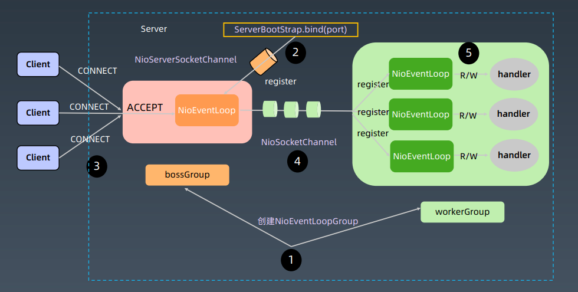

### Netty运行原理

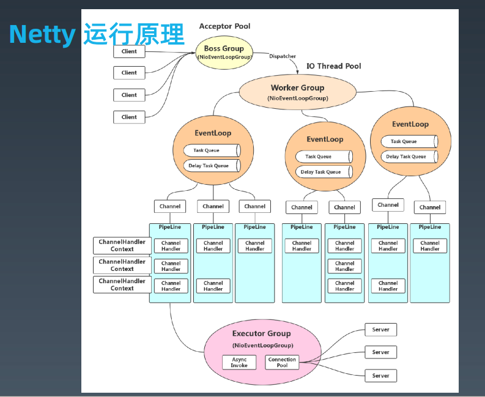

**什么是EventLoop？**

可以认为是一个不断轮询监听IO事件的selector

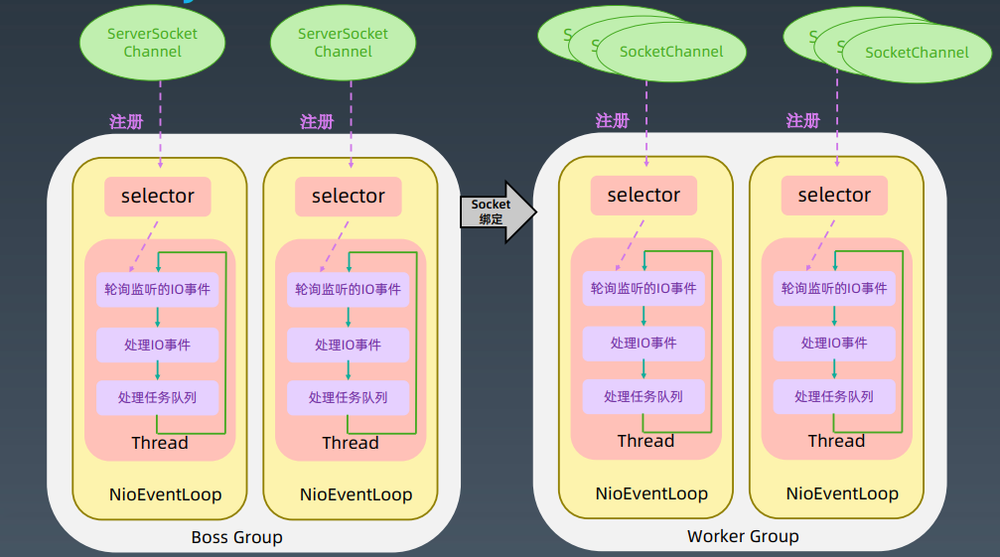

### Netty代码实现

 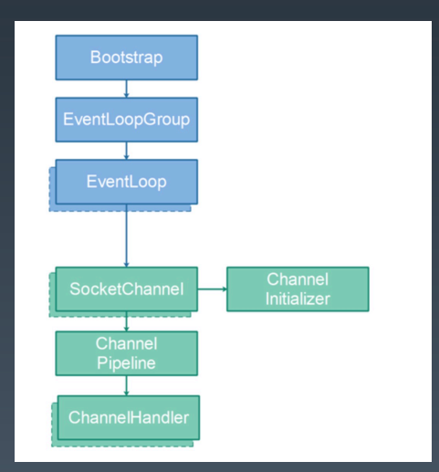

#### 关键对象

Bootstrap：启动对象，开启socket

EventLoopGroup

EventLoop

SocketChannel：连接

ChannelInitializer：初始化

ChannelPipeline：处理器链

ChannelHandler：处理器

#### 注意：

在实现代码的时候，在绑定ChannelPipline时，需要注意是ChannelInboundHandler，还是ChannelOutboundHandler。

## Netty网络程序优化

### 粘包和拆包

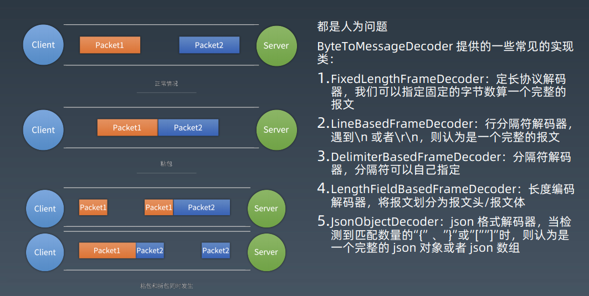

- FixedLengthFrameDecoder 定长协议
- LineBasedFrameDecoder 行分隔符--\n或者\r\n
- DelimiterBasedFrameDecoder 自定义分隔符
- LengthFieldBasedDecoder 将报文分为报文头/报文体
- JSONObjectDecoder json格式

### Nagle算法与TCP_NODELAY

Nagle算法，缓冲区满或达到超时设置，才会将数据从缓冲区发出

设置TCP_NODAY，禁用Nagle算法

MTU：最大传输单元，默认**1500Byte**

MSS：最大分段大小（每单元实际负载）默认MTU-20(IP)-20(TCP)=**1460Byte**

### 连接优化


MSL 报文最大生存时间

Linux通过*/proc/sys/net/ipv4/tcp_fin_timeout*  配置

Win通过注册表中的*TcpTimedWaitDelay*  配置

### Netty优化

1. **不要阻塞EventLoop**

2. **系统参数优化**

   *ulimit -a, /proc/sys/net/ipv4/tcp_fin_timeout, TcpTimedWaitDelay*

3. **缓冲区优化**

   *SO_RCVBUF/SO_SNDBUF/SO_BACKLOG/ REUSEXXX*

   **SO_BACKLOG**：正在建立过程中的网络连接个数

   **REUSE**：复用TIME_WAIT状态的连接

4. **心跳周期优化**

   *心跳机制与断线重连*

5. **内存与ByteBuffer优化**

   *DirectBuffer 与 HeapBuffer*

6. 其他优化

   \- ioRatio：默认50:50
   \- Watermark：IO压力水位
   \- TrafficShaping：流控——流量整形，排队处理

## 典型应用——API网关

### API网关的四大职能：

1. **请求接入:**作为所有API接口服务请求的接入点
2. **业务聚合：**作为所有后端业务服务的聚合点
3. **中介策略：**实现**安全、验证、路由、过滤、流控等**策略
4. **统一管理：**对所有API服务和策略进行统一管理

### 网关的分类

- 流量网关
- 业务网关

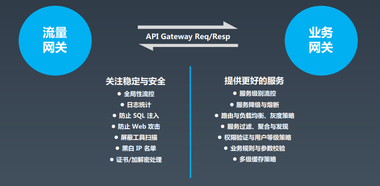

### 几种常见的API网关

Zuul是 Netflix 开源的 API 网关系统，它的主要设计目标是动态路由、监控、弹性和安全。  

主要由pre、routing、post这3种过滤器组成

#### Zuul-1.0（BIO方式）

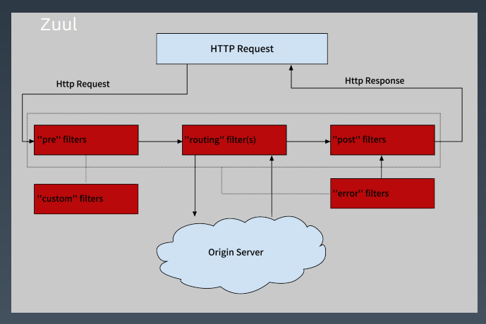

#### Zuul-2.x（基于Netty内核重构）

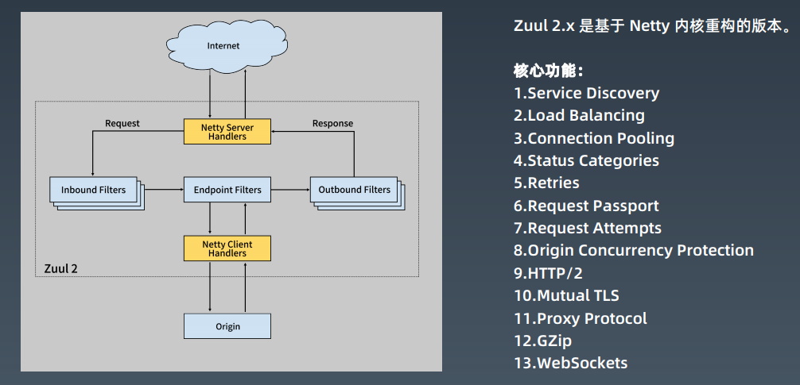

#### Spring Cloud Gateway

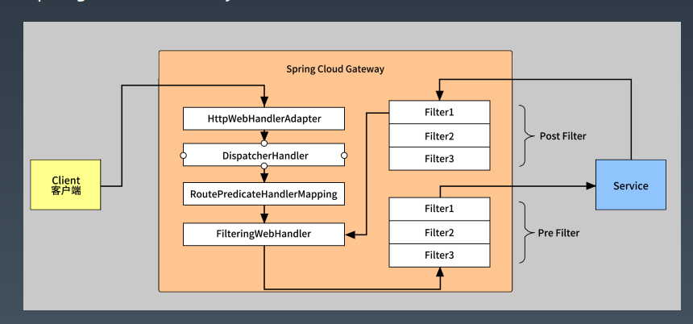

### 网关对比

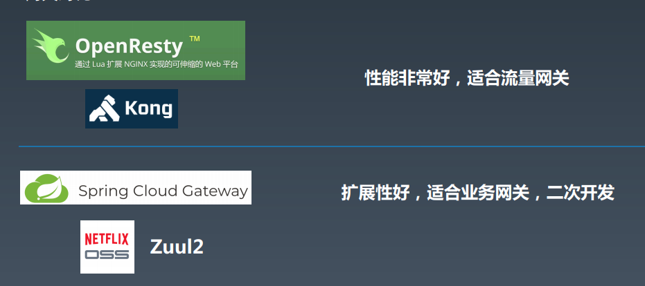

## 自己手动实现API网关

### gateway-1.0

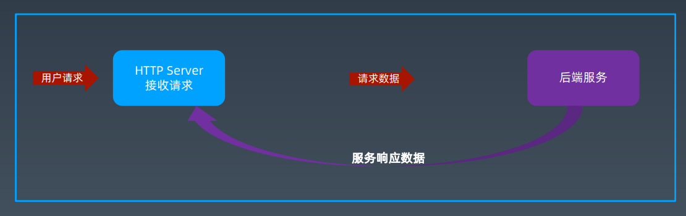

### gateway-2.0

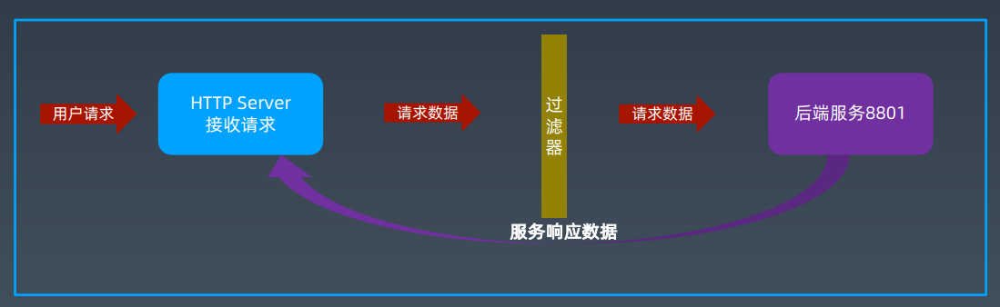

### gateway-3.0

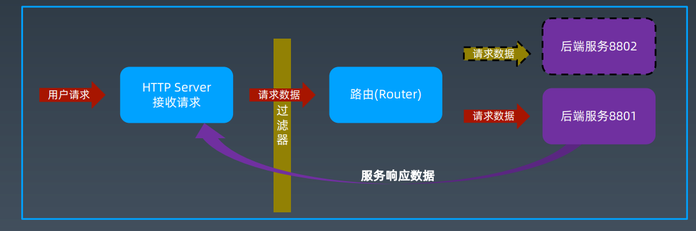

### 我们如何做架构设计

考虑好：

- 技术复杂度与业务复杂度
- 抽象：概念理清、正确命名
- 组件之间的相互关系

