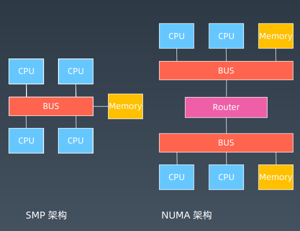
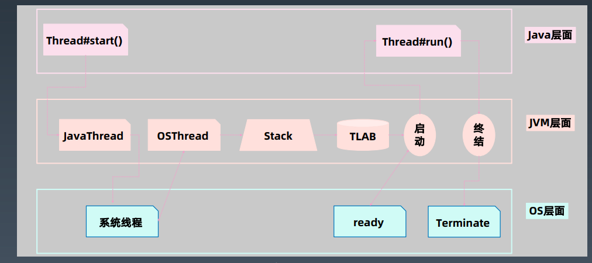
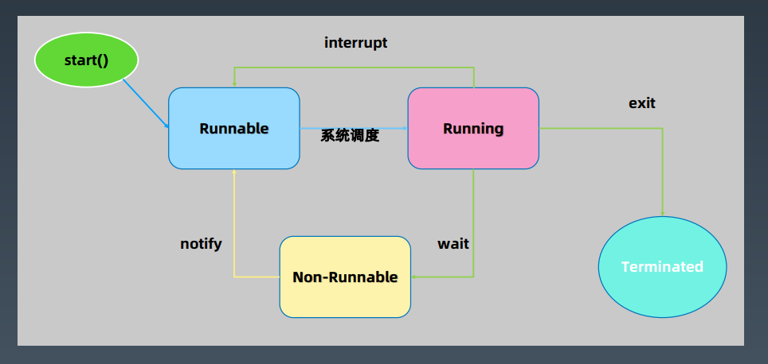
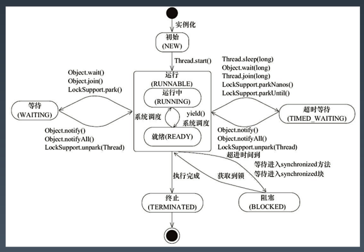
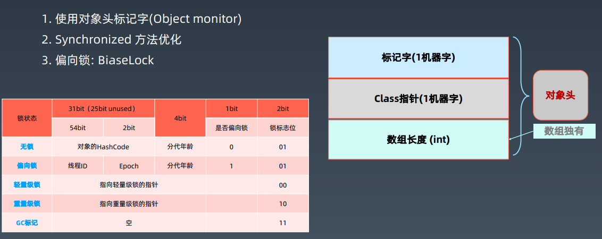

# 多线程学习笔记

## 多线程基础

### 为什么会有多线程

本质原因：摩尔定律的失效-->多核+分布式时代的来临

 

NUMA架构可扩展性更好，SMP架构中CPU对同一内存的竞争太强

### Java线程的创建过程



## Java多线程

### 关于守护线程

主线程在执行时，系统如果发现其他线程都是守护线程，会马上结束进程。 

### 关于线程的start()和run()

- Thread#start():创建新线程
- Thread#run() : 本线程调用  

### 线程状态



### Thread类的重要属性和方法

| 重要属性/方法                          | 说明                              |
| :------------------------------------- | --------------------------------- |
| volatile String name;                  | 线程名称                          |
| boolean daemon = false;                | 后台守护线程标志——决定JVM优雅关闭 |
| Runnable target;                       | 任务（只能通过构造函数传入）      |
| synchronized void start()              | 启动新线程并自动执行              |
| void join()                            | [协作] 等待某个线程执行完毕       |
| static native Thread currentThread();  | 获取当前线程信息                  |
| static native void sleep(long millis); | 线程睡眠并让出CPU时间片           |

### wait&notify

| Object#方法                        | 说明                                                         |
| ---------------------------------- | ------------------------------------------------------------ |
| void wait()                        | 释放锁+等待0ms+唤醒后，尝试获取锁                            |
| void wait(long timeout, int nanos) | 释放锁+wait+到时间自动唤醒/中途唤醒（精度：nanos>0，则timeout+1) |
| native void wait(long timeout)     | 释放锁+wait+到时间自动唤醒/中途唤醒（唤醒之后需要自动获取锁） |
| native void notify()               | 发送信号通知1个等待线程                                      |
| native void notifyAll()            | 发送信号通知所有等待线程                                     |

- Thread.sleep：释放CPU，不释放锁

- Object#wait：释放对象锁和CPU

### Thread的状态改变操作

1. **Thread.sleep(long millis)**，一定是当前线程调用此方法，当前线程进入 TIMED_WAITING 状态，但不释放对象锁，millis 后线程自动苏醒进入就绪状态。作用：给其它线程执行机会的最佳方式。
2.  **Thread.yield()**，一定是当前线程调用此方法，当前线程放弃获取的 CPU 时间片，但不释放锁资源，由运行状态变为就绪状态，让 OS 再次选择线程。作用：让相同优先级的线程轮流执行，但并不保证一定会轮流执行。实际中无法保证yield() 达到让步目的，因为让步的线程还有可能被线程调度程序再次选中Thread.yield() 不会导致阻塞。该方法与sleep() 类似，只是不能由用户指定暂停多长时间。
3. **t.join()/t.join(long millis)**，当前线程里调用其它线程 t 的 join 方法，当前线程进入WAITING/TIMED_WAITING 状态，当前线程不会释放已经持有的对象锁，因为内部调用了 t.wait，所以会释放t这个对象上的同步锁。线程 t 执行完毕或者 millis 时间到，当前线程进入就绪状态。其中，wait 操作对应的 notify 是由 jvm 底层的线程执行结束前触发的。
4. **obj.wait()**，当前线程调用对象的 wait() 方法，当前线程释放 obj 对象锁，进入等待队列。依靠 notify()/notifyAll()唤醒或者 wait(long timeout) timeout 时间到自动唤醒。唤醒会，线程恢复到 wait 时的状态。
5.  **obj.notify()** 唤醒在此对象监视器上等待的单个线程，选择是任意性的。notifyAll() 唤醒在此对象监视器上等待的所有线程。

### Thread的中断与异常处理

1. 线程内部自己处理异常，不溢出到外层（Future除外）

2. 如果线程被**Object.wait, Thread.join和Thread.sleep**三种方法之一阻塞，此时调用该线程的interrupt()方法，那么该线程将抛出一个**InterruptedException中断异常**（该线程必须事先预备好处理此异常），从而**提早终结**被阻塞状态。

3. 如果线程没有被阻塞，这时调用 interrupt() 将不起作用，直到执行到wait/sleep/join 时，才马上会抛出InterruptedException。

   #### 如果是计算密集型操作怎么办？

   分段处理，每个片段检查一下状态，是不是要终止  

### Thread状态



可以简化记忆为**RWB**

## 线程安全

### 多线程执行会遇到什么问题？

**竞态条件：**多个线程竞争同一资源时，如果对资源的访问顺序敏感，就称为存在竞态条件

**临界区：**导致竞态条件发生的代码区

对竞态条件不进行恰当的控制，就会导致线程安全问题

### 并发相关的特性

**原子性：**原子操作，这些操作时不可被中断的，要么执行，要么不执行

**可见性：**对于可见性，Java提供了**volatile**关键字来保证

被volatile修饰时，它会保证修改的值会立即被更新到主存

synchronized和Lock也能够保证可见性

> **volatile并不能保证原子性**

**有序性：**Java 允许编译器和处理器对指令进行重排序，但是重排序过程不会影响到单线程程序的执行，却会影
响到多线程并发执行的正确性  

可以通过volatile关键字来保证一定的有序性（synchronized和Lock也可以）

#### happens-before原则

1. 程序次序规则：一个线程内，按照代码先后顺序执行 
2. 锁定规则：一个unLock操作先行发生于后面对同一个锁的lock操作
3. Volatile变量规则：对一个变量的写操作先行发生于后面对这个变量的读操作
4. 传递规则
5. 线程启动规则：Thread对象的start()方法先行发生于此线程的每一个动作
6. 线程中断规则：对线程的interrupt()方法的调用先行发生于被中断线程的代码检测到中断事件的发生
7. 线程终结规则：线程中所有的操作都先行发生于线程的终止检测，我们可以通过Thread.join()方法结束，Thread.isAlive()的返回值来检测线程已终止执行
8. 对象终结规则：一个对象的初始化完成先行发生于他的finalize()方法的开始

一个简单的实际例子（多线程计数）

```java
package java0.conc0301.sync;

public class Counter {
    private int sum = 0;
    private Object lock = new Object();

    public void incr() {
        synchronized (lock) {
            sum = sum + 1;
        }
    }

    public int getSum() {
        return sum;
    }

    public static void main(String[] args) throws InterruptedException {
        int loop = 10_0000;

        Counter counter = new Counter();
        for (int i = 0; i < loop; i++) {
            counter.incr();
        }

        System.out.println("single thread : " + counter.getSum());

        // test multiple threads
        final Counter counter2 = new Counter();
        Thread t1 = new Thread(() -> {
            for (int i = 0; i < loop / 2; i++) {
                counter2.incr();
            }
        });
        Thread t2 = new Thread(() -> {
            for (int i = 0; i < loop / 2; i++) {
                counter2.incr();
            }
        });

        t1.start();
        t2.start();
        Thread.sleep(1000);

        System.out.println("multiple threads: " + counter2.getSum());
    }
}

```

### sychronized的实现



### volatile

1. 每次读取都强制从主内存刷数据

2. **使用场景：**单个线程写，多个线程读

3. 原则：能不用就不用，不确定的时候也不用

4. 替代方案：Atomic原子操作类

   **volatile关键字，保证了关键字上下两边的排序不变**

### **final关键字**

| final定义类型     | 说明                                                         |
| ----------------- | ------------------------------------------------------------ |
| final class XXX   | 不允许继承                                                   |
| final 方法        | 不允许Override                                               |
| final 局部变量    | 不允许修改                                                   |
| final 实例属性    | 构造函数/初始化块/<init>之后不允许变更<br />只能赋值一次<br />安全发布：构造函数结束返回时，final域最新的值保证对其他线程可见 |
| final static 属性 | <clinit>静态块执行后不允许变更；<br />只能赋值一次           |

写代码最大化使用final是个好习惯

## **线程池原理和应用**

### 线程池的几个概念

1. Excutor：执行者，顶层接口
2. ExcutorService： 接口API
3. ThreadFactory： 线程工厂
4. ThreadPoolExecutor： 
5. Excutors：工具类，创建线程

### **Executor-执行者**

| 重要方法                        | 说明             |
| ------------------------------- | ---------------- |
| void execute(Runnable command); | 执行可运行的任务 |

线程池从功能上看，就是一个任务执行器
submit 方法 -> **有返回值**，用 Future 封装
execute 方法 -> **无返回值**  

### ExecutorService  

| 重要方法                                       | 说明                                     |
| ---------------------------------------------- | ---------------------------------------- |
| void execute(Runnable command);                | 执行可运行的任务                         |
| void shutdown();                               | 关闭线程池                               |
| List<Runnable> shutdownNow();                  | 立即关闭                                 |
| Future<?> submit(Runnable task);               | 提交任务; 允许获取执行结果               |
| <T> Future<T> submit(Runnable task, T result); | 提交任务（指定结果）; 控制\|获取执行结果 |
| <T> Future<T> submit(Callable<T> task);        | 提交任务; 允许控制任务和获取执行结果     |

shutdown()：停止接收新任务，**原来的任务继续执行**
**shutdownNow()**：停止接收新任务，原来的任务停止执行
boolean awaitTermination(timeOut, unit)：阻塞当前线程，返回是否线程都执行完  

### ThreadPoolExecutor

```java
public void execute(Runnable command) {
	if (command == null)
		throw new NullPointerException();
	int c = ctl.get();
	if (workerCountOf(c) < corePoolSize) {
		if (addWorker(command, true))
			return;
		c = ctl.get();
	}
	if (isRunning(c) && workQueue.offer(command)) {
		int recheck = ctl.get();
		if (! isRunning(recheck) && remove(command))
			reject(command);
		else if (workerCountOf(recheck) == 0)
			addWorker(null, false);
	}
	else if (!addWorker(command, false))
		reject(command);
}
```

**线程池创建逻辑：**

1. 判断是否大于**corePoolSize**，小于直接创建；
2. 大于则加入**workQueue**；
3. workQueue满了，则继续创建线程，直至到达**maxinumPoolSize**；
4. 如果达到**maxinumPoolSize且workQueue满了**，则执行**拒绝策略**

#### **线程池参数——缓冲队列**

BlockingQueue 是双缓冲队列。BlockingQueue 允许两个线程同时向队列一个存储，一个取出操作。在保证并发安全的同时，提高了队列的存取效率。

1. **ArrayBlockingQueue**：规定大小的 BlockingQueue，其构造**必须指定大小**。其所含的对象是 FIFO 顺序排序的。
2. **LinkedBlockingQueue**：**大小不固定**的 BlockingQueue，若其构造时指定大小，生成的BlockingQueue 有大小限制，不指定大小，其大小有 Integer.MAX_VALUE 来决定。其所含的对象是 FIFO 顺序排序的。
3. **PriorityBlockingQueue**：类似于 LinkedBlockingQueue，但是其所含对象的排序不是 FIFO，而是依据对象的自然顺序或者构造函数的 Comparator 决定。
4. **SynchronizedQueue**：特殊的 BlockingQueue，对其的操作必须是放和取交替完成  

#### 线程池参数——拒绝策略

1. ThreadPoolExecutor.AbortPolicy: 丢弃任务并抛出 RejectedExecutionException异常
2. ThreadPoolExecutor.DiscardPolicy：丢弃任务，但是不抛出异常
3. ThreadPoolExecutor.DiscardOldestPolicy：丢弃队列最前面的任务，然后重新提交被拒绝的任务
4. ThreadPoolExecutor.CallerRunsPolicy：由调用线程（提交任务的线程）处理该任务

#### 线程池参数——ThreadFactory

```java
public class CustomThreadFactory implements ThreadFactory {
	private AtomicInteger serial = new AtomicInteger(0);
	@Override
	public Thread newThread(Runnable r) {
		Thread thread = new Thread(r);
		thread.setDaemon(true); // 根据需要，设置守护线程
		thread.setName("CustomeThread-" + serial.getAndIncrement());
		return thread;
	}
}
```

#### 重要方法和属性

| 重要属性/方法                      | 说明           |
| ---------------------------------- | -------------- |
| int corePoolSize;                  | 核心线程数     |
| int maximumPoolSize;               | 最大线程数     |
| ThreadFactory threadFactory;       | 线程创建工厂   |
| BlockingQueue<Runnable> workQueue; | 工作队列       |
| RejectedExecutionHandler handler;  | 拒绝策略处理器 |
| void execute(Runnable command)     | 执行           |
| Future<?> submit(Runnable task)    | 提交任务       |
| submit(Runnable task, T result)    | 提交任务       |
| submit(Callable<T> task)           | 提交任务       |

### Executors创建线程池的方法

1. **newSingleThreadExecutor**
   创建一个单线程的线程池。这个线程池只有一个线程在工作，也就是相当于单线程串行执行所有任务。如果这个唯一的线程因为异常结束，那么会有一个新的线程来替代它。此线程池保证所有任务的执行顺序按照任务的提交顺序执行。
2. **newFixedThreadPool**
   创建固定大小的线程池。每次提交一个任务就创建一个线程，直到线程达到线程池的最大大小。线程池的大小一旦达到最大值就会保持不变，如果某个线程因为执行异常而结束，那么线程池会补充一个新线程。
3. **newCachedThreadPool**
   创建一个可缓存的线程池。如果线程池的大小超过了处理任务所需要的线程，那么就会回收部分空闲（60秒不执行任务）的线程，当任务数增加时，此线程池又可以智能的添加新线程来处理任务。
   此线程池不会对线程池大小做限制，线程池大小完全依赖于操作系统（或者说JVM）能够创建的最大线程大小。
4. **newScheduledThreadPool**
   创建一个大小无限的线程池，此线程池支持定时以及周期性执行任务的需求。  

### 创建固定线程池的经验

不是越大越好，太小肯定也不好

假设核心数为N

1、如果是 **CPU 密集型**应用，则线程池大小设置为 N 或 N+1
2、如果是 **IO 密集型**应用，则线程池大小设置为 2N 或 2N+2  

