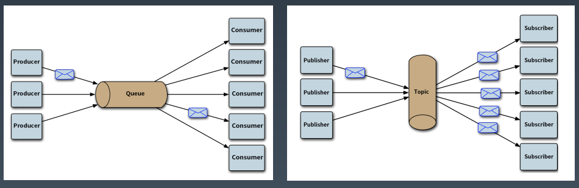

# Spring Messaging技术

## 为什么要使用消息技术？

- 同步转异步
- 高峰分流

## 两种消息模式

1. 消息队列模式
2. 主题订阅模式



springjms-receiver.xml

```xml
<?xml version="1.0" encoding="UTF-8"?>
<beans xmlns="http://www.springframework.org/schema/beans"
       xmlns:xsi="http://www.w3.org/2001/XMLSchema-instance"
       xmlns:context="http://www.springframework.org/schema/context"
       xmlns:jms="http://www.springframework.org/schema/jms"
       xsi:schemaLocation="http://www.springframework.org/schema/beans
                            http://www.springframework.org/schema/beans/spring-beans.xsd
                            http://www.springframework.org/schema/context
                            http://www.springframework.org/schema/context/spring-context-4.3.xsd http://www.springframework.org/schema/jms https://www.springframework.org/schema/jms/spring-jms.xsd">
    <context:component-scan base-package="io.lcfgrn.springjms"/>

    <bean id="connectionFactory" class="org.apache.activemq.ActiveMQConnectionFactory">
        <property name="brokerURL"  value="tcp://localhost:61616"/>
        <property name="trustAllPackages" value="true"/>
    </bean>

    <bean id="queue" class="org.apache.activemq.command.ActiveMQQueue">
        <constructor-arg value="test.queue"/>
    </bean>

    <bean id="jmsTemplate" class="org.springframework.jms.core.JmsTemplate">
        <property name="connectionFactory" ref="connectionFactory"/>
    </bean>
    <jms:listener-container container-type="default" connection-factory="connectionFactory"
                            acknowledge="auto">
        <jms:listener destination="test.queue" ref="jmsListener" method="onMessage"/>
    </jms:listener-container>
</beans>
```

springjms-sender.xml

```xml
<?xml version="1.0" encoding="UTF-8"?>
<beans xmlns="http://www.springframework.org/schema/beans"
       xmlns:xsi="http://www.w3.org/2001/XMLSchema-instance"
       xmlns:context="http://www.springframework.org/schema/context"
       xsi:schemaLocation="http://www.springframework.org/schema/beans
                            http://www.springframework.org/schema/beans/spring-beans.xsd
                            http://www.springframework.org/schema/context
                            http://www.springframework.org/schema/context/spring-context-4.3.xsd">
    <context:component-scan base-package="io.lcfgrn.springjms"/>

    <bean id="connectionFactory" class="org.apache.activemq.ActiveMQConnectionFactory">
        <property name="brokerURL" value="tcp://localhost:61616"/>
    </bean>

    <bean id="queue" class="org.apache.activemq.command.ActiveMQQueue">
        <constructor-arg value="test.queue"/>
    </bean>

    <bean id="jmsTemplate" class="org.springframework.jms.core.JmsTemplate">
        <property name="connectionFactory" ref="connectionFactory"/>
    </bean>
</beans>
```

