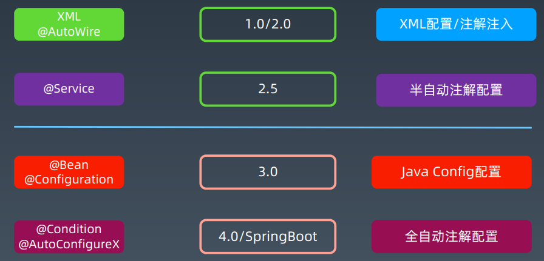

# Spring XML配置原理

自动化配置工具

XmlBeans -> Spring-xbean

## 原理：

1. 根据Bean的字段结构，自动生成XSD
2. 根据Bean的字段结构，自动加载XML文件

## Spring Bean配置方式演化



## XML的结构解析

```xml
<?xml version="1.0" encoding="UTF-8"?>
<beans xmlns="http://www.springframework.org/schema/beans"
       xmlns:xsi="http://www.w3.org/2001/XMLSchema-instance"
       xmlns:context="http://www.springframework.org/schema/context"
       xmlns:aop="http://www.springframework.org/schema/aop"
       xsi:schemaLocation="http://www.springframework.org/schema/beans
                        http://www.springframework.org/schema/beans/spring-beans-3.2.xsd
                        http://www.springframework.org/schema/context
                        http://www.springframework.org/schema/context/spring-context-3.2.xsd
                        http://www.springframework.org/schema/aop
                        https://www.springframework.org/schema/aop/spring-aop.xsd">
</beans>              
```

- ns==>命名空间

- xmlns==>beans的默认命名空间

- xmlns:context==>定义的context的命名空间

- xmlns:xsi==>XML规范的命名空间

- xsi:schemalLocation==>指定不同命名空间用到的具体xsd

  格式为：一个命名空间，紧接一个具体xsd

  