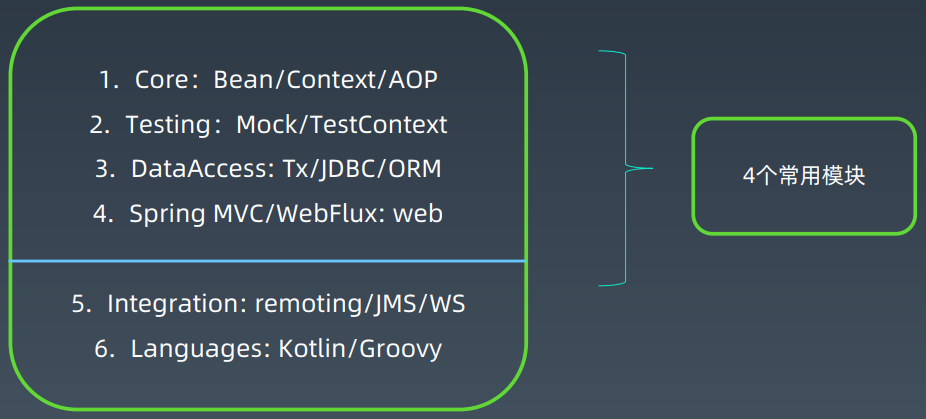

# Spring学习笔记

## Spring技术发展

- 2002.10，Rod Johnson

- 2004,1.0发布

- 2006.10，Spring 2.0发布

- 2007年，Spring 2.5发布
  - 支持Java 6，支持注解配置
- 2009.12，Spring 3.0发布
- 2012.7，Rod Johnson离开团队
- 2013.4，Spring应用项目都转移到Pivotal
- 2.13.12，Spring 4.0发布
- 2014-2017，Spring 4.x
- 2017.9.24，Spring 5.0GA 发布

### Spring的三大产品系列

- Spring Boot
  - Build Anything

- Spring Cloud
  - Coordinate Anything
- Spring Cloud Data Flow
  - Connect Everything

## Spring框架设计

### Spring framework 6大模块

