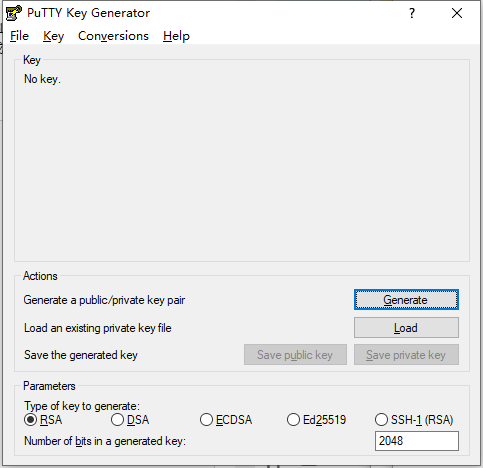
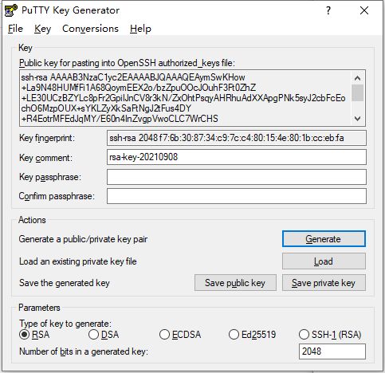
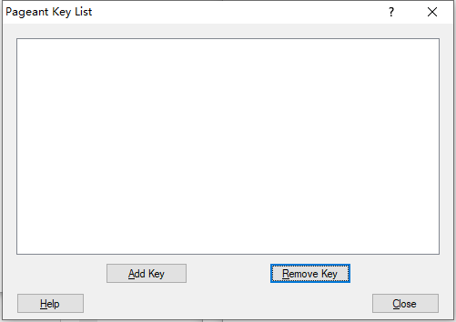
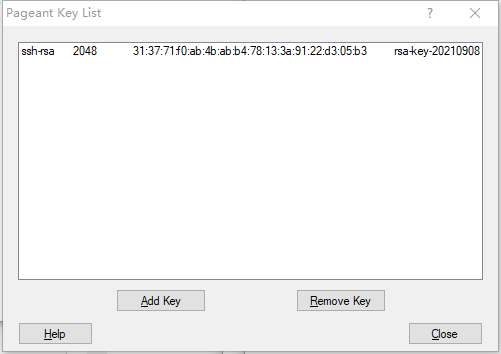

# 配置git的ssh密钥和TortoiseGit的puttyKey的方法

## 配置git的ssh密钥

1. 在任意地方，新建文件夹，为防止出错，最好保证该文件夹目录都是英文。

2. 打开新建文件夹，空白处右键，菜单中选择 `Git Bash here` ，弹出命令行，输入命令 `git init` ，目录下会生成一个新的 `.git`的文件夹，用于本地代码仓库。

 

3. 配置本地仓库的账号和邮箱

```js
$ git config --global user.name "Your Name"
$ git config --global user.email "email@example.com"
```

4. 为了避免每次远程访问需要输密码，将使用ssh登陆。ssh应该与本机信息绑定。查看自己电脑 `C:\Users\Administrator` 目录下是否有 `.ssh` 文件夹。如果没有就需要生成。

```js
$ ssh-keygen -t rsa -C "youremail@example.com"
```

按 `Enter` 键一直到结束。

5. ssh只是本地详细，需要在Github中备份，才能被验证。打开自己的Github，在My Profile中，点击Add Public Key，title随意。

6. key中的内容在本机C盘中，`C:\Users\Administrator`，里面有个`.ssh`文件夹，用文本文档打开 `id_rsa.pub` ，将里面的内容全部复制到key中，即可

## 配置TortoiseGit的puttyKey

一.运行TortoiseGit开始菜单中的puttygen程序，如下图示 

 

二.点击“Generate”按钮，鼠标在上图的空白地方来回移动直到进度条完毕，就会自动生一个随机的key，如下图示 

 

```
如有需要，可以为密钥设置对应的访问密码，就是修改上图中“Key passphrase”和“Confirm passphrase”的值。本人这里未设置访问密码，为空
```

三.将生成的key复制，粘贴到git账户中的SSH public key中，这就是适用于git的公钥

四.点击上图中的“Save private key”按钮,将生成的key保存为适用于TortoiseGit的私钥（扩展名为.ppk）

五.运行TortoiseGit开始菜单中的Pageant程序，程序启动后将自动停靠在任务栏中，图标显示为，双击该图标，弹出key管理列表，如下图示

 

```
点击Add Key,将保存的ppk文件添加进来即可，添加后如下图
```

 
点击close完成