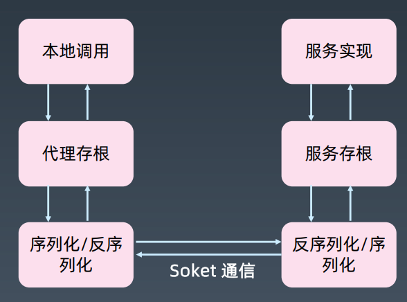

# RPC基本原理

## RPC的定义

RPC（Remote Procedure Call）远程过程调用

## RPC原理

 

处理过程：

1. 生成本地代理存根：Stub
2. 本地序列化反序列化
3. 网络通信
4. 远程序列化反序列化
5. 远程服务存根：Skeleton
6. 调用实际业务服务
7. 原路返回服务结果
8. 返回给本地调用方

### RPC原理-1.设计

客户端和服务端需要共享POJO实体类定义，以及接口定义。

不同框架下的实现：

1. webservice/WSDL
2. REST/WADL
3. PB/IDL

### RPC原理-2.代理

Java下，代理可以选择动态代理，或者AOP实现

-C#，有RemoteProxy

-Flex可以使用动态方法和属性

### RPC原理-3.序列化

1. 语言原生的序列化，JAVA/RMI，C#/Remoting
2. 二进制平台无关，Hessian，avro，avro，kyro，fst等
3. 文本，JSON、XML等

第2/3点都是跨平台的

### RPC原理-4.网络传输

- TCP/SSL/TLS
- HTTP/HTTPS

### RPC原理-5.查找实现类

通过接口查找服务端的实现类

一般是注册方式

dubbo默认将接口和实现类配置到Spring

## 几种常见的RPC技术框架

- Corba（Common ObjectRequest Broker Architecture）公共对象请求代理体系结构，OMG
  组织在1991年提出的公用对象请求代理程序结构的技术规范。底层结构是基于面向对象模型的，
  由 OMG 接口描述语言（OMG Interface Definition Language，OMG IDL）、对象请求代理
  （Objec tRequest Broker，ORB）和 IIOP 标准协议（Internet Inter ORB Protocol，也称网络
  ORB交换协议）3个关键模块组成。
- COM（Component Object Model，组件对象模型）是微软公司于1993年提出的一种组件技术，
  它是一种平台无关、语言中立、位置透明、支持网络的中间件技术。很多老一辈程序员心目中的神
  书《COM 本质论》。  

## 几种常见的RPC技术

- Corba/RMI/.NET Remoting

-  JSON RPC, XML RPC，WebService(Axis2, CXF)

  - Spring主要支持的是CXF

  - ws-attachment 附件

-  Hessian, Thrift, Protocol Buffer, gRPC  

  - Hessian-dubbo使用 HTTP协议二进制的

  - Thrift是Facebook创建和开源的一个RPC技术，使用二进制TCP的方式

    - 早期版本，每个服务占用一个端口

  - gRPC是google用go语言创建的

    